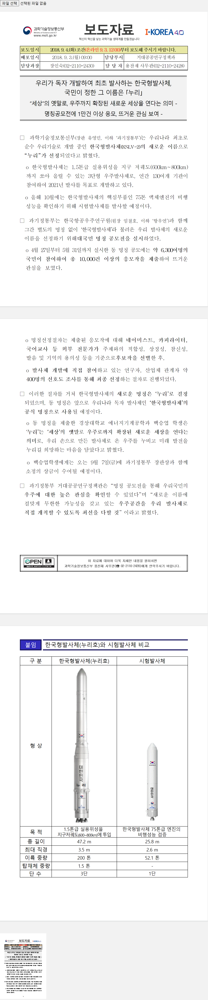

# hwpjs
본 제품은 한글과컴퓨터의 한/글 문서 파일(.hwp) 공개 문서를 참고하여 개발하였습니다.  
[Link](https://www.hancom.com/etc/hwpDownload.do)  

## Demo
[Link](https://kbl-ref.com/hwpjs)  

후술 할 동명의 hwpjs와 동일한 문서를 읽은 이미지입니다.


## USE PLUGIN
- [sheetjs - CFB](http://sheetjs.com)
```
Compound Binary File을 읽기 위한 플러그인
```
- [pako](https://github.com/nodeca/pako)
```
Compound Binary File에서 일부 압축 된 코드를 읽기 위한 플러그인(zlib)
```

## 참고한 Github
- [pyhwp](https://github.com/mete0r/pyhwp)
- [hwpjs](https://github.com/hahnlee/hwp.js)


## MIT License

Copyright <2021~> COPYRIGHT Shifeed

Permission is hereby granted, free of charge, to any person obtaining a copy of this software and associated documentation files (the "Software"), to deal in the Software without restriction, including without limitation the rights to use, copy, modify, merge, publish, distribute, sublicense, and/or sell copies of the Software, and to permit persons to whom the Software is furnished to do so, subject to the following conditions:

The above copyright notice and this permission notice shall be included in all copies or substantial portions of the Software.

THE SOFTWARE IS PROVIDED "AS IS", WITHOUT WARRANTY OF ANY KIND, EXPRESS OR IMPLIED, INCLUDING BUT NOT LIMITED TO THE WARRANTIES OF MERCHANTABILITY, FITNESS FOR A PARTICULAR PURPOSE AND NONINFRINGEMENT. IN NO EVENT SHALL THE AUTHORS OR COPYRIGHT HOLDERS BE LIABLE FOR ANY CLAIM, DAMAGES OR OTHER LIABILITY, WHETHER IN AN ACTION OF CONTRACT, TORT OR OTHERWISE, ARISING FROM, OUT OF OR IN CONNECTION WITH THE SOFTWARE OR THE USE OR OTHER DEALINGS IN THE SOFTWARE.


# 간단한 프로그램 소개

## 개발 동기

심심해서.  
2주 동안 작업하였습니다.  
관련 프로그램이 있나 찾아보았더니 위에서도 언급한 hwpjs, pyhwp 등이 이미 공개되어있었습니다.  
살짝 만들기 싫었지만 그냥 만들었습니다.  
개발 시작시 타입스크립트, 속도를 위하여 WASM 등을 고려하였으나 호환성이나 접근성, 사용 편의를 위해 순수한 자바스크립트로 개발하였습니다.

## 사용조건
위의 라이센스에도 사실 언급되어있는 내용이지만 저작자를 표기한다는 조건으로 자유롭게 사용하시면 됩니다.  
아직 상용프로그램이나 실 사용 소스로 쓰기에는 아직까지 많은 무리가 있습니다.  
개발기간도 개발기간이지만 개발자라고도 부르기 민망한 수준의 개발 능력입니다.
사용시 불편한점이나 버그 발생시 버그가 발생하는 문서 등을 피드백 해주세요.  
ES6기준 문법으로 개발하였으며 IE에선 테스트하지 않았습니다.
확인하지 않았지만, Babel 등을 활용하여 사용은 할 수 있을것으로 보입니다.

## 개발 진행 내역
1. 페이지 처리, 페이지 여백 처리(일부 미완성)
2. 테이블 처리
3. 글자 서식 적용(언어별 서식 미적용, 자간, 장평, 공백 개행단락의 부정확한 크기 등 일부 미구현)
4. 글머리표 적용(일부 구현)

### 개발시 에로사항
공식문서가 생각보다 많이 부정확하여 속성이나 데이터를 가져오는데 번거로움이 있음.  
웹과 한글 문서간의 서식을 css만으로 처리하기에 애매한 부분이 있음.  
ex) 줄간격의 경우 적용은 되어있으나 css와 hwp문서의 줄간격 수치의 오차범위를 잡기 어렵다.

### 개발 목표
1. 대부분의 문서 구현(공개 문서가 정확하지 않아 100%는 현실적으로 불가능)
2. 웹워커 형식의 구동버전


### 업데이트 내역

##### 0.01 Beta
- HWPATAG_PARA_LINE_SEG를 활용한 높이 적용.
- TABLE의 셀 속성에 대한 문서가 부정확함. 기본값 외에 적용되지 않게 적용.

##### 0.02 Beta
- DOCINFO에 있는 스타일정보를 클래스화 시켜 소스를 좀 더 효율적으로 수정.
 우선 알고 있는 모든 서식 적용. 단 언어별로 다른 서식을 정해야 하나 유니코드 구분 등 여러가지 번거로운 작업이 있어 한글 서식을 일괄 적용시킴
 폰트 및 자간 좀 더 유사하게 적용.
- 머리말 꼬리말 적용.
- 테이블, 이미지, 객체 등의 글자처럼 취급 적용
- 썸네일(한글에서 기본지원하는) 출력 함수(getPrvImage), 한글 내에 써진 모든 텍스트가 저장되는 변수 추가.


## 사용법
```html
<!DOCTYPE html>
<html lang="ko">
<head>
  <meta charset="UTF-8">
  <meta http-equiv="X-UA-Compatible" content="IE=edge">
  <meta name="viewport" content="width=device-width, initial-scale=1.0">
  <title>Document</title>
  <link rel="stylesheet" href="index.css">
</head>
<body>
  <script src="./cfb.js"></script>
  <script src="./pako.js"></script>
  <script src="./hwpjs.js"></script>
  <div class="hwpjs">
  </div>
</body>
</html>
```
```javascript
(async () => {
  const file = await fetch('./noori.hwp');
  const hwpData = await file.arrayBuffer();
  const hwp = new hwpjs(hwpData);
  const data = hwp.getHtml();
  document.querySelector('.hwpjs').innerHTML = data;
})();
```

추후 이미지만 따로 출력 가능하게, 또는 텍스트만 출력 따로 가능하게, 서식정보만 출력 가능하게 등의 사용자 함수를 만들고 문서화 예정에 있습니다.  
다만 현재 코드는 개발 중에 있는 코드이며, 주석 및 잉여 코드들이 제거되어있지 않고, 코드도 정리되어있지 않습니다.  
한글 버전 5017 이하에서 작성된 문서에서 이미지가 있는 경우 불러오지 못하는 이슈가 있습니다.  
공식 문서에서도 잘못 쓰여있는 대표적인 내용 중 하나로 현재도 어찌저찌 처리 가능하지만, 땜빵이 아닌 정확하게 잘못된 코드를 문서화 하여 처리 할 예정에 있어 보류 중입니다.


### 미완성 상태인데 공개하는 이유
1. 어느정도 틀은 잡았으나 나머지 작업량이 방대한걸 알아버려서.
2. 누군가에게 만든다고 떠들고 싶어서.
3. 현재 나와있는 웹버전 hwpjs보다는 조금 더 진척 되어 보여서
4. 공식문서가 좆같아서.

### 이름 중복에 대한 고민
이미 어느정도 구현 된 상태에서 목적과 이름이 같은 (소스는 다름) 동명의 소스가 깃허브에 hwpjs가 있다는걸 알았습니다.  
생성자 명을 이미 hwpjs로 해버려서 수정하기에는 번거롭고 제가 네이밍 센스가 없기 때문에 수정할만한 이름이 떠오르지 않았습니다.  
언제든지 개명이 가능한 플러그인이니 원하시는 플러그인 이름이 있으면 남겨주세요


#### 이슈 제안 및 건의

해당 깃허브 또는 https://shifeed.tistory.com 사이트에 남겨주세요.


##### 제작자 정보
Copyright Ohah OR Shifeed OR Vorfeed  
E-mail bookyoon173@gmail.com
